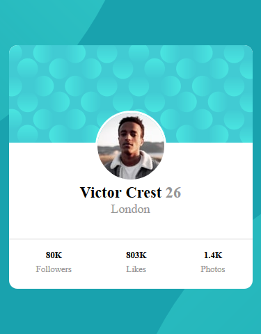

# Frontend Mentor - Profile card component solution

This is a solution to the [Profile card component challenge on Frontend Mentor](https://www.frontendmentor.io/challenges/profile-card-component-cfArpWshJ). Frontend Mentor challenges help you improve your coding skills by building realistic projects. 

## Table of contents

- [Overview](#overview)
  - [The challenge](#the-challenge)
  - [Screenshot](#screenshot)
  - [Links](#links)
- [My process](#my-process)
  - [Built with](#built-with)
  - [What I learned](#what-i-learned)
  - [Continued development](#continued-development)
- [Acknowledgments](#acknowledgments)

**Note: Delete this note and update the table of contents based on what sections you keep.**

## Overview

### The challenge

- Build out the project to the designs provided

### Screenshot





### Links

- Solution URL: (https://github.com/Jemikemi/Project/tree/main/profile-card-component-main)
- Live Site URL: (https://jemikemi.github.io/Project/profile-card-component-main/)

## My process

### Built with

- Semantic HTML5 markup
- CSS custom properties
- Flexbox
- Mobile-first workflow


### What I learned

i learnt to use the background-position css property and how to use two background images as a background.

```css
body{
    background-color: var(--Darkcyan);
    background-image: url("images/bg-pattern-top.svg"), url("images/bg-pattern-bottom.svg");
    background-position: bottom 45vh right 45vw, top 45vh left 45vw;
    background-repeat: no-repeat;
}
```


### Continued development

The position css property is a bit tricky to me, i would like to keep working on it.

## Acknowledgments

I woud like to appreciate @motuncoded. I used her work as a reference to understand how to manipulate the background.

